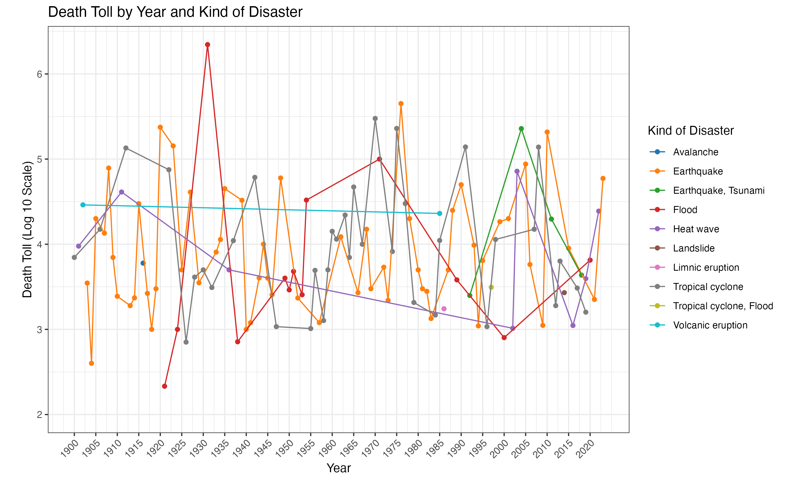

# DS_assessment_2023
This is the repository for my answers to the data science placement assessment in 2023. 

## Question 1

The above visualization illustrates the logarithmic scale representation of the death toll resulting from significant natural disasters that have occurred annually during the 20th and 21st centuries. The data has been sourced from the Wikipedia page. Before creating the plot, I transformed the death toll data by converting the ranges (e.g., 6,000-8,000 to 7,000) and adjusting upper bounds (e.g., 20,000+ to 20,000). This transformation enhances visualization and analysis. The logarithmic scale helps in presenting the data more comprehensively; for instance, a value of 6 on the log scale corresponds to 1,000,000 (10^6) in actual death toll. The plot is color-coded to distinguish between ten different types of disasters. 

The visual analysis reveals some key patterns. Earthquakes emerge as the most frequent deadliest natural disasters, followed by tropical cyclones. Observing the connecting lines between consecutive events of the same type, no consistent trend is shown in terms of death toll variations over the years.

It's notable that the death toll typically ranges from the scale of 1,000 (10^3) to 100,000 (10^5) for most events. However, certain events stand out: the lowest death toll, in the range of 100 (10^2), is attributed to the San Antonio floods in 1921, while the highest death toll, exceeding 1,000,000 (10^6), is linked to the China floods in 1931. Interestingly, both of these events fall within the flood category.

In summary, this visualization provides insights into the distribution and trends of major natural disasters' death tolls over the years, highlighting the dominance of earthquakes and tropical cyclones.